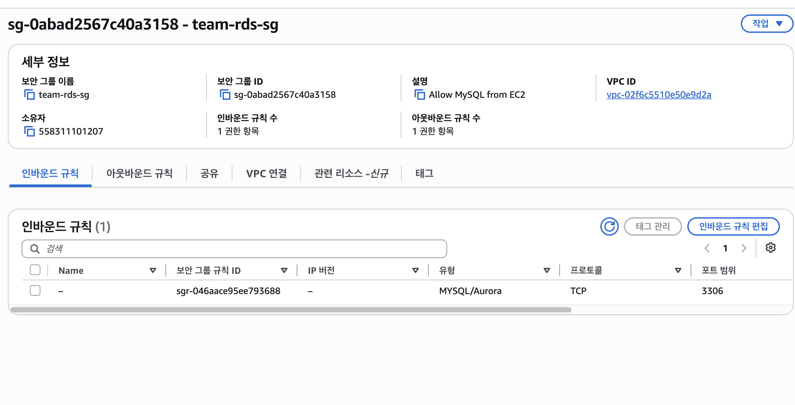

# Team Member Service

팀원의 정보를 저장하고 프로필 이미지를 관리하는 API 프로젝트입니다.

---

## LV0. AWS Budget 설정

AWS 실습 중 예상하지 못한 비용이 발생하는 것을 확인하기 위해 Budget을 설정했습니다.

- 월 예산: `US$100`
- 알림 기준: 실제 비용 `80%`
- 알림 발생 금액: `US$80`
- 알림 수신 방법: 이메일


---
## LV1. 네트워크 및 애플리케이션 배포

### 네트워크 구성

별도의 VPC를 생성하고 Public Subnet과 Private Subnet을 분리했습니다.

Spring Boot 애플리케이션을 실행하는 EC2 인스턴스는 외부에서 접근할 수 있도록 Public Subnet에 배치했습니다.

```text
VPC CIDR: 10.0.0.0/16
Public Subnet CIDR: 10.0.0.0/20
Private Subnet CIDR: 10.0.128.0/20
EC2 Public IPv4: 3.38.162.212
```

> Public Subnet과 Private Subnet의 CIDR은 AWS 콘솔에서 확인한 실제 값으로 교체해야 합니다.

### 애플리케이션 배포 환경

```text
Java: 17
Spring Boot: 4.1.0
Server Port: 8080
EC2 실행 프로필: local
Database: H2
배포 파일: app.jar
```

LV1에서는 EC2 외부 배포를 검증하기 위해 H2를 사용하는 `local` 프로필로 애플리케이션을 실행했습니다.

운영용 MySQL과 `prod` 프로필 연결은 LV2에서 Amazon RDS 및 Parameter Store 구성 후 적용합니다.

### 팀원 등록 API

```http
POST /api/members
Content-Type: application/json
```

요청 예시:

```json
{
  "name": "찰리",
  "age": 27,
  "mbti": "ENFP"
}
```

응답 예시:

```json
{
  "id": 1,
  "name": "찰리",
  "age": 27,
  "mbti": "ENFP",
  "profileImageKey": null
}
```

### 팀원 조회 API

```http
GET /api/members/{id}
```

요청 예시:

```text
GET /api/members/1
```

응답 예시:

```json
{
  "id": 1,
  "name": "찰리",
  "age": 27,
  "mbti": "ENFP",
  "profileImageKey": null
}
```

### Profile 분리

실행 환경에 따라 데이터베이스 설정을 분리했습니다.

- `local`: H2 Database 사용
- `prod`: MySQL 설정 사용
- LV2에서 `prod` 프로필을 Amazon RDS 및 Parameter Store와 연결할 예정입니다.

### 로깅 및 예외 처리

API 요청이 들어오면 INFO 로그를 기록하도록 구현했습니다.

예외가 발생하면 ERROR 로그와 Stack Trace를 기록하고, 공통 예외 응답을 반환하도록 구성했습니다.

### Actuator Health Check

외부에서 EC2 애플리케이션의 실행 상태를 확인했습니다.

```text
GET http://3.38.162.212:8080/actuator/health
```

응답:

```json
{
  "status": "UP"
}
```

### 배포 검증 화면

#### Actuator Health 확인


#### 팀원 API 확인


---

## LV2. DB 분리 및 보안 연결하기

### RDS 구성

로컬 접속용 Public Subnet에 MySQL RDS 인스턴스를 생성하고, 로컬 PC에서 접속 테스트를 완료했습니다.

```text
RDS Engine: MySQL
RDS Endpoint: database-2.cvsuss6emezq.ap-northeast-2.rds.amazonaws.com
Port: 3306
```

### 보안 그룹 체이닝

RDS 보안 그룹의 인바운드 규칙(Source)에는 IP 주소가 아닌, LV1에서 생성한 EC2의 보안 그룹 ID만 등록하여 EC2 ↔ RDS 간 연결만 허용하도록 구성했습니다.



### Parameter Store

DB 접속 정보(url, username, password)와 확인용 파라미터(team-name)를 AWS Systems Manager Parameter Store에 저장했습니다.

```text
/team-service/db/url
/team-service/db/username
/team-service/db/password
/team-service/team-name
```

애플리케이션은 기동 시 `ParameterStoreLoader`가 위 파라미터를 조회해 System Property로 주입하고, `application-prod.yml`의 `${DB_URL}`, `${DB_USERNAME}`, `${DB_PASSWORD}`와 `application.yml`의 `${TEAM_NAME}` 플레이스홀더가 이 값을 사용해 RDS에 연결합니다.

로컬 개발 환경(`local` 프로필)에서는 `PARAMETER_STORE_ENABLED`가 설정되어 있지 않아 Parameter Store를 호출하지 않고, 기존과 동일하게 H2로 동작합니다.

### Actuator Info 확장

Parameter Store에 저장한 `team-name` 값이 `/actuator/info` 엔드포인트에서 조회되도록 `TeamInfoContributor`를 구현했습니다.

```http
GET http://3.38.162.212:8080/actuator/info
```

응답 예시:

```json
{
  "team-name": "채빈"
}
```

---

## LV3. 프로필 사진 기능 추가와 권한 관리

### S3 버킷

"모든 퍼블릭 액세스 차단"을 켠 상태로 프로필 이미지 저장용 S3 버킷을 생성했습니다.

```text
S3 Bucket: eam-service-profile-0414
Region: ap-northeast-2
```

### IAM Role

Access Key를 코드나 설정 파일에 넣지 않고, S3 접근 권한이 있는 IAM Role을 생성해 EC2 인스턴스에 연결했습니다. 애플리케이션은 `DefaultCredentialsProvider`를 사용해 EC2에 연결된 Role의 임시 자격 증명으로 S3에 접근합니다.

### 프로필 이미지 업로드 API

```http
POST /api/members/{id}/profile-image
Content-Type: multipart/form-data
```

MultipartFile로 전달받은 이미지를 S3 버킷에 업로드하고, 이미지 key를 `Member.profileImageKey`에 저장합니다.

### 프로필 이미지 조회 API (Presigned URL 발급)

```http
GET /api/members/{id}/profile-image
```

S3에 저장된 이미지에 대한 Presigned URL을 유효기간 **7일**로 발급합니다. 클라이언트는 이 URL로만 이미지를 다운로드할 수 있습니다.

응답 예시:

```json
{
  "url": "https://{bucket}.s3.ap-northeast-2.amazonaws.com/profile-images/1/....jpg?X-Amz-...",
  "expiresAt": "2026-08-07T12:00:00Z"
}
```

### 발급받은 Presigned URL

```text
URL: {실제 Presigned URL}
만료 시각: {실제 만료 시각}
```

> Presigned URL은 만료되면 접근이 불가능합니다. 채점 기준일 이전에 새로 발급받아 위 값을 최신 URL로 교체해야 합니다.

---