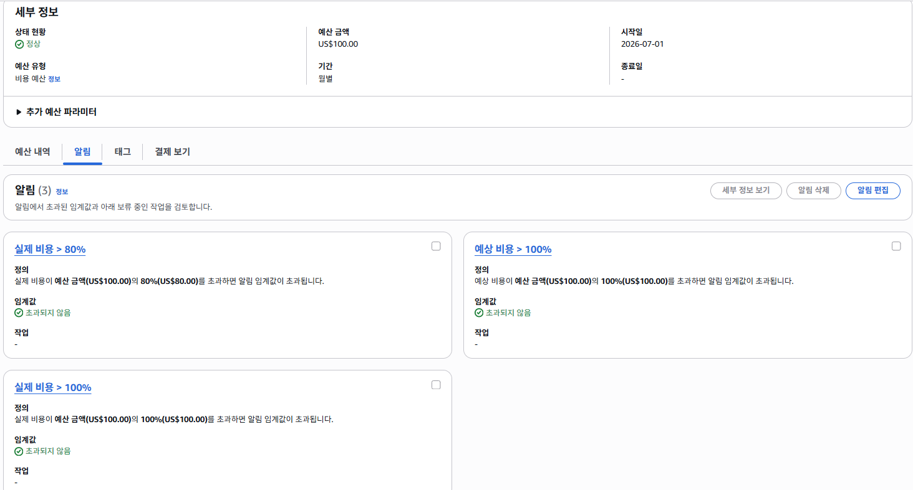
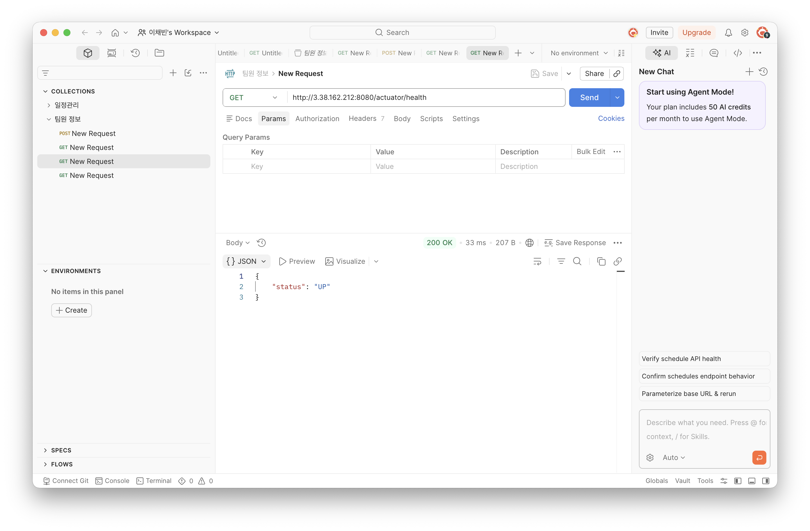
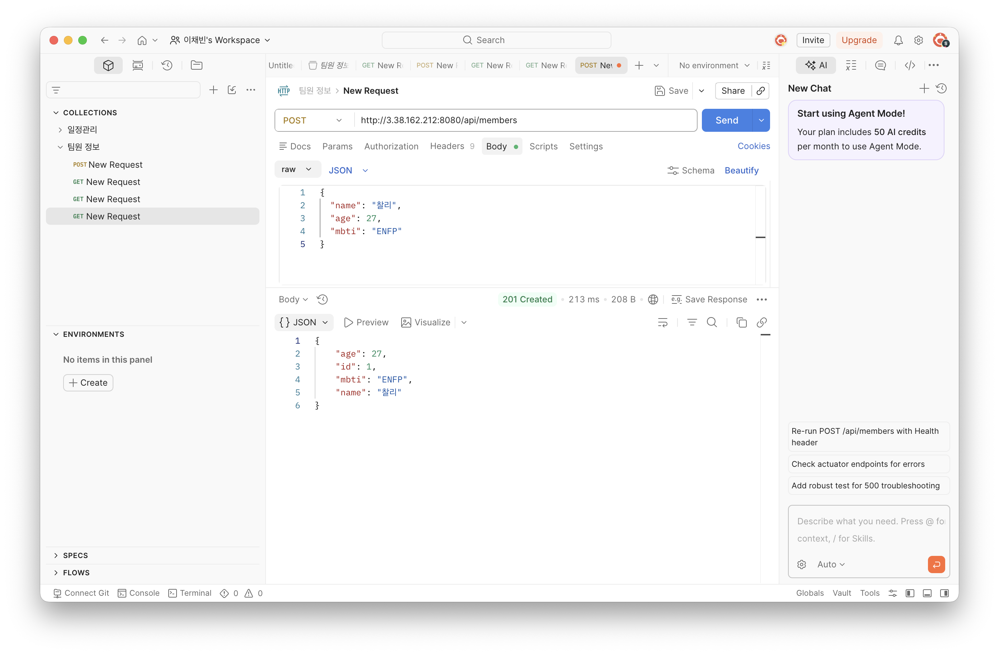

# Team Member Service

팀원의 정보를 저장하고 프로필 이미지를 관리하는 API 프로젝트입니다.

---

## LV0. AWS Budget 설정

AWS 실습 중 예상하지 못한 비용이 발생하는 것을 확인하기 위해 Budget을 설정했습니다.

- 월 예산: `US$100`
- 알림 기준: 실제 비용 `80%`
- 알림 발생 금액: `US$80`
- 알림 수신 방법: 이메일



---
## LV1. 네트워크 및 애플리케이션 배포

### 네트워크 구성

별도의 VPC를 생성하고 Public Subnet과 Private Subnet을 분리했습니다.

Spring Boot 애플리케이션을 실행하는 EC2 인스턴스는 외부에서 접근할 수 있도록 Public Subnet에 배치했습니다.

```text
VPC CIDR: 10.0.0.0/16
Public Subnet CIDR: <PUBLIC_SUBNET_CIDR>
Private Subnet CIDR: <PRIVATE_SUBNET_CIDR>
EC2 Public IPv4: 3.38.162.212
```

> Public Subnet과 Private Subnet의 CIDR은 AWS 콘솔에서 확인한 실제 값으로 교체해야 합니다.

### 애플리케이션 배포 환경

```text
Java: 17
Spring Boot: 4.1.0
Server Port: 8080
EC2 실행 프로필: local
Database: H2
배포 파일: app.jar
```

LV1에서는 EC2 외부 배포를 검증하기 위해 H2를 사용하는 `local` 프로필로 애플리케이션을 실행했습니다.

운영용 MySQL과 `prod` 프로필 연결은 LV2에서 Amazon RDS 및 Parameter Store 구성 후 적용합니다.

### 팀원 등록 API

```http
POST /api/members
Content-Type: application/json
```

요청 예시:

```json
{
  "name": "찰리",
  "age": 27,
  "mbti": "ENFP"
}
```

응답 예시:

```json
{
  "id": 1,
  "name": "찰리",
  "age": 27,
  "mbti": "ENFP",
  "profileImageKey": null
}
```

### 팀원 조회 API

```http
GET /api/members/{id}
```

요청 예시:

```text
GET /api/members/1
```

응답 예시:

```json
{
  "id": 1,
  "name": "찰리",
  "age": 27,
  "mbti": "ENFP",
  "profileImageKey": null
}
```

### Profile 분리

실행 환경에 따라 데이터베이스 설정을 분리했습니다.

- `local`: H2 Database 사용
- `prod`: MySQL 설정 사용
- LV2에서 `prod` 프로필을 Amazon RDS 및 Parameter Store와 연결할 예정입니다.

### 로깅 및 예외 처리

API 요청이 들어오면 INFO 로그를 기록하도록 구현했습니다.

예외가 발생하면 ERROR 로그와 Stack Trace를 기록하고, 공통 예외 응답을 반환하도록 구성했습니다.

### Actuator Health Check

외부에서 EC2 애플리케이션의 실행 상태를 확인했습니다.

```text
GET http://3.38.162.212:8080/actuator/health
```

응답:

```json
{
  "status": "UP"
}
```

### 배포 검증 화면

#### Actuator Health 확인



#### 팀원 API 확인



---